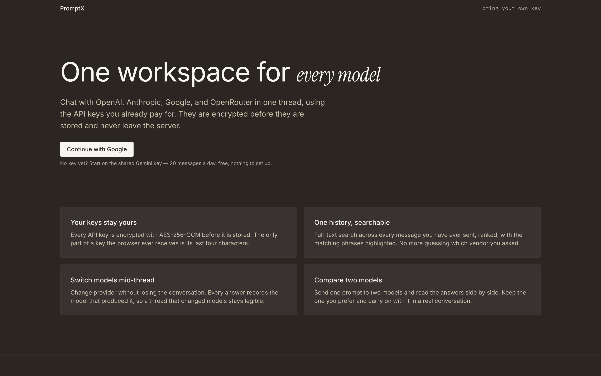

# PromptX

An AI chat workspace with Google Sign-In. Chat with OpenAI, Anthropic, Google,
and OpenRouter models using your own API keys — encrypted at rest — or use a
shared Gemini key capped at 5 messages a day.

**Live: https://promptx-ypm8.onrender.com**

> Hosted on Render's free tier, which spins down after 15 minutes idle. The
> first request after a quiet spell takes about a minute to wake. That is a
> deliberate trade rather than an oversight — see
> [the cold-start decision](./context/architecture.md#the-cold-start-problem).



## What it does

- **One history across four providers.** Switch between GPT, Claude, Gemini, and OpenRouter models mid-conversation without leaving the thread.
- **Bring your own key.** Keys are AES-256-GCM encrypted server-side; the browser only ever sees the last four characters.
- **Usable in thirty seconds.** A shared Gemini key covers 5 messages a day for anyone who hasn't added a key yet.
- **Navigate long threads.** An outline rail lists every prompt in a conversation as a jump target.
- **Find anything.** Postgres full-text search across every message, ranked, with highlighted snippets.
- **Reusable prompts.** A tagged library, insertable into any conversation.
- **Compare models.** One prompt, two models, side by side — then continue with the winner.
- **Attachments.** Images and PDFs, gated by what the selected model can actually read.
- **Share and export.** Public read-only links, revocable instantly; Markdown or JSON export.

## Stack

TypeScript · Next.js 16 (App Router) · Supabase (Postgres, Google OAuth, RLS,
Storage, pg_cron) · Vercel AI SDK v7 · Tailwind v4 + shadcn/ui · Vitest +
Playwright · deployed on **Render** as a single Node web service.

## The three rules this codebase is built around

It holds other people's API keys and other people's conversations, so three
things are non-negotiable:

1. **No decrypted API key ever leaves the server.** Not in a response body, not in a log, not in an error message. `last_four` is the only key material a client receives — enforced by a test that greps the route layer for the decrypt helper.
2. **RLS is the isolation boundary, not application code.** Every table carries a policy scoped to `auth.uid()`. `listConversations()` deliberately has no `user_id` filter: a missing `where` clause must not be able to leak a row.
3. **The shared key is quota-enforced on two independent axes** — a per-user daily cap and a global monthly circuit breaker. Both checks are mandatory; neither substitutes for the other.

## Architecture in one pass

A user signs in with Google through Supabase Auth. `POST /api/chat` owns
conversation creation as well as sending, which is what keeps a refused request
from stranding an empty conversation in the sidebar — nothing is persisted until
the request is certain to reach a provider, and the route marks that line
explicitly.

Model selection is keyed on `(provider, modelId)` and validated against a
catalog in `src/lib/models.ts`, which is an enforcement boundary rather than a
list for a dropdown: an unknown id is refused before any key is decrypted. If
the chosen model is the shared one, a daily slot is **claimed rather than
checked** — a single SQL statement whose `where message_count < limit` sits on
the upsert's `do update` branch, because a read followed by a write reopens the
race in any form.

Responses stream over SSE, bounded in application code by `STREAM_TIMEOUT_MS`.
Render permits a 100-minute request, so nothing in the platform will cut a hung
provider connection — the application must.

Two scheduled jobs run inside Postgres via `pg_cron`, not on the platform:
quota reconciliation every ten minutes, and attachment reaping hourly through an
Edge Function, because storage objects cannot be deleted from SQL.

Full detail, including the invariants and the data model, is in
[`context/architecture.md`](./context/architecture.md).

## Running it locally

Requires Node ≥ 20.9 and pnpm (the version is pinned in `packageManager`).

```bash
pnpm install
cp .env.example .env.local   # then fill it in — see below
pnpm dev                     # http://localhost:3000
```

**Every variable in `.env.example` is required at build time, secrets included.**
`NEXT_PUBLIC_*` are inlined into the bundle, and `src/server/env.ts` parses the
rest at module load so the process fails to boot rather than failing at the
first request that needs one. A missing secret fails `pnpm build`, not the first
page view.

You will need:

- A Supabase project. Migrations live in `supabase/migrations/` and are applied through the Supabase MCP — there is no local stack, so `supabase db reset` does not apply here.
- A Google OAuth client. Its authorized redirect URI is **Supabase's** callback (`https://<ref>.supabase.co/auth/v1/callback`), not the app's — entering the app URL yields `redirect_uri_mismatch`.
- `ENCRYPTION_KEY`: 32 bytes base64, `openssl rand -base64 32`. Rotating it invalidates every stored key, so rotation needs a re-encryption migration.
- A Google AI key for the shared fallback. This deployment runs it on the **free tier**, which grants 20 requests a day across all users — not per user — which is why `NEXT_PUBLIC_SHARED_KEY_DAILY_MESSAGE_LIMIT` is 5 rather than the 20 the design originally assumed. If you put a billed key here instead, set a hard budget cap on the account: the in-app circuit breaker fails open by design, so the provider-side cap is the only thing that actually bounds the bill.

### Commands

| Command | What it does |
| --- | --- |
| `pnpm dev` | Development server (Turbopack is default in Next 16) |
| `pnpm build` | Production build |
| `pnpm start` | Serve the production build — this is what Render runs |
| `pnpm lint` | ESLint, flat config |
| `pnpm typecheck` | `tsc --noEmit` |
| `pnpm test` | Vitest. Skips hosted suites with a banner when `.env.local` is absent; refuses to run when it is present but incomplete |
| `pnpm test:coverage` | The same suite with a v8 coverage report over `src/server/` |
| `pnpm test:e2e` | Playwright, against a production build. Needs `.env.local` and `pnpm exec playwright install chromium` |

## Testing

637 unit tests across 46 files, and 79 end-to-end tests across nine specs —
four flow specs plus an accessibility, keyboard, responsive, live-region and
performance audit suite.

The habit that matters more than the count: **a test that has never failed
proves nothing.** Guards here are verified by breaking the thing they protect
and confirming the suite notices. That practice has caught a test comparing a
function against itself, a test swallowing its own assertion inside its own
`catch`, a concurrency test that could not fail at all, and a "streaming" test
that would have passed identically against a non-streaming blob.

## Deployment

Render Blueprint in [`render.yaml`](./render.yaml) — one Node web service, no
serverless. `export const maxDuration` does nothing here, there is no Edge
runtime, the process is long-lived so in-memory caches genuinely persist, and
scheduled work lives in `pg_cron` rather than on the platform. Most Next.js
deployment advice assumes Vercel and is wrong here in those specific ways.

## Documentation

The `context/` folder is the source of truth for this project.

| File | Contents |
| --- | --- |
| [`context/project-overview.md`](./context/project-overview.md) | What the product is, who it's for, scope boundaries |
| [`context/architecture.md`](./context/architecture.md) | Stack, folder structure, data model, RLS policies, invariants |
| [`context/code-standards.md`](./context/code-standards.md) | Engineering rules every change must follow |
| [`context/library-docs.md`](./context/library-docs.md) | Project-specific usage patterns per library |
| [`context/build-plan.md`](./context/build-plan.md) | 8 phases, 38 features, in order |
| [`context/progress-tracker.md`](./context/progress-tracker.md) | Live build status |
| [`context/constraints.md`](./context/constraints.md) | What still binds, grouped by topic — read before any decision |
| [`context/build-journal.md`](./context/build-journal.md) | Dated archive of decisions, gotchas, and verification results per feature |
| [`context/DESIGN.md`](./context/DESIGN.md) | The design system — every colour, type scale, radius, spacing value |

## Licence

MIT — see [LICENSE](./LICENSE).
