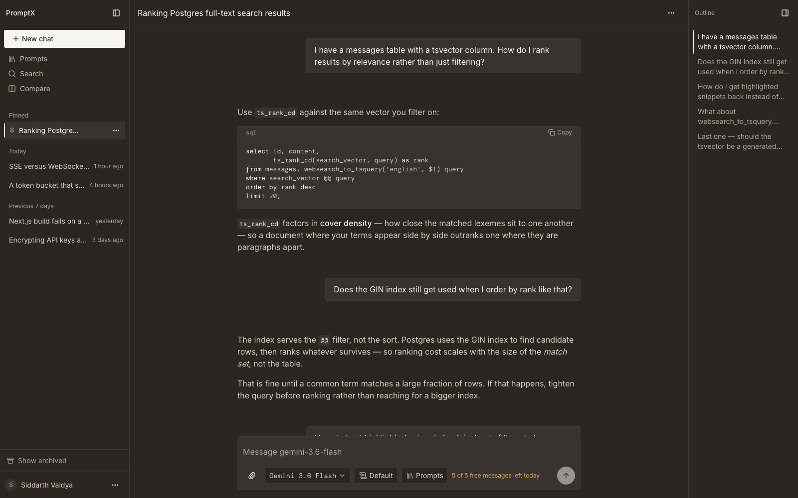
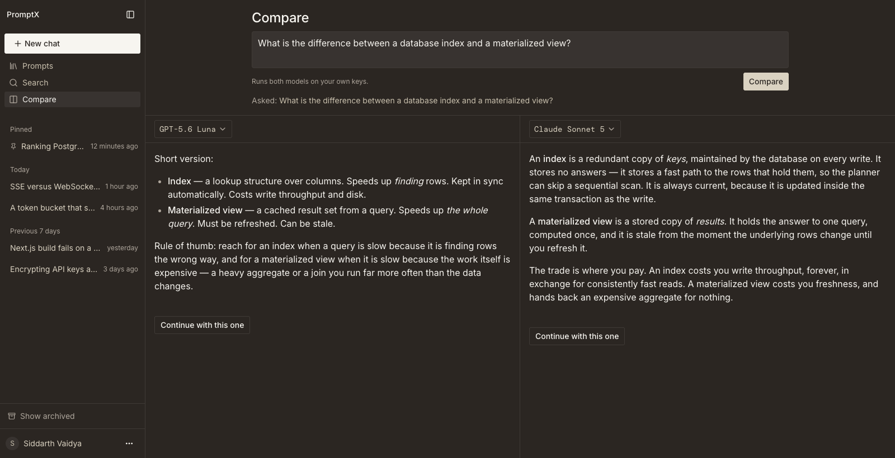
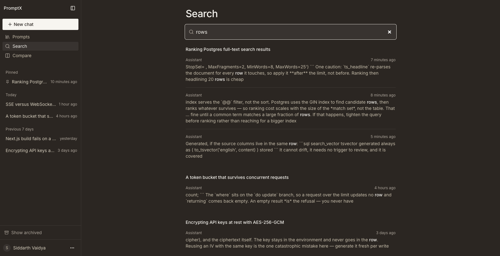
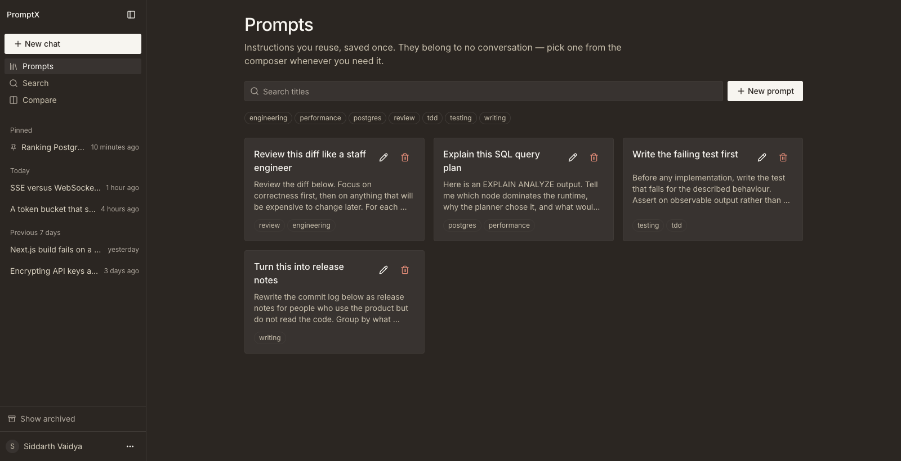
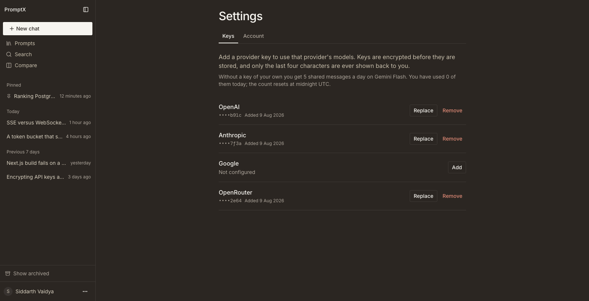
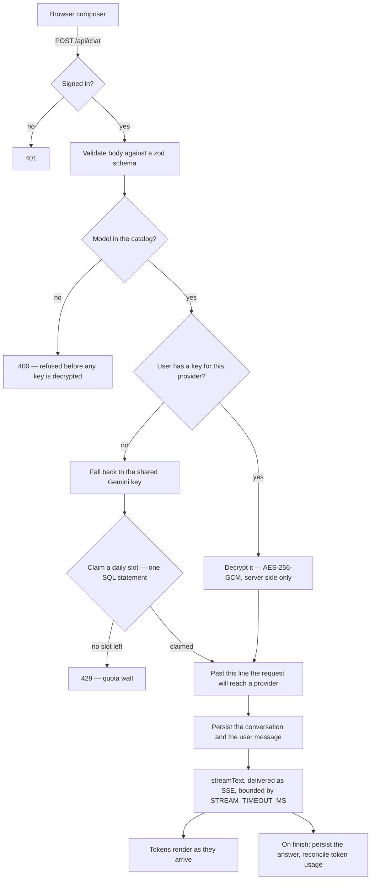

<div align="center">

# PromptX

**One AI chat workspace for OpenAI, Anthropic, Google, and OpenRouter — using your own API keys, encrypted at rest.**

[](https://promptx-ypm8.onrender.com)
[](https://nextjs.org)
[](https://www.typescriptlang.org)
[](https://supabase.com)
[](#testing)
[](./LICENSE)

**[promptx-ypm8.onrender.com](https://promptx-ypm8.onrender.com)**

</div>

> Hosted on Render's free tier, which spins down after 15 minutes idle. The first
> request after a quiet spell takes about a minute to wake. That is a deliberate
> trade rather than an oversight — see
> [the cold-start decision](./context/architecture.md#the-cold-start-problem).



## Why I built this

I was paying for three chat subscriptions and still could not search across them.
My history was split between vendor websites that cannot see each other, so
switching models in the middle of a problem meant copying the context by hand
into a different tab. Meanwhile I was already paying for API access to all of
those models, and that access had no interface attached to it.

PromptX is the workspace I wanted instead: one history, one search index, one
prompt library, and a model picker that changes the provider without changing
anything else.

## Features

**One history across four providers.** Switch between GPT, Claude, Gemini, and
OpenRouter models mid-conversation without leaving the thread. Each message
records the model that produced it.

**Usable in thirty seconds.** A shared Gemini key covers 5 messages a day for
anyone who has not added a key yet, so the product works before it asks for
anything.

**Compare two models on one prompt**, then continue the conversation with
whichever answer was better.



**Postgres full-text search across every message you own** — ranked, grouped by
conversation, with the matched phrases highlighted.



**A reusable prompt library**, tagged and filterable, insertable into any
conversation from the composer.



**Bring your own key.** Keys are AES-256-GCM encrypted server-side. The browser
only ever receives the last four characters.



Also included: an outline rail that turns every prompt in a long thread into a
jump target, edit-and-resend with truncation, regenerate against a different
model, per-conversation system prompts, image and PDF attachments gated by what
the selected model can actually read, revocable public share links, and
Markdown or JSON export.

## Stack

TypeScript · Next.js 16 (App Router) · React 19 · Supabase (Postgres, Google
OAuth, RLS, Storage, pg_cron) · Vercel AI SDK v7 · Tailwind v4 + shadcn/ui ·
Vitest + Playwright · deployed on **Render** as a single Node web service.

## The three rules this codebase is built around

It holds other people's API keys and other people's conversations, so three
things are non-negotiable:

1. **No decrypted API key ever leaves the server.** Not in a response body, not in a log, not in an error message. `last_four` is the only key material a client receives — enforced by a test that greps the route layer for the decrypt helper.
2. **RLS is the isolation boundary, not application code.** Every table carries a policy scoped to `auth.uid()`. `listConversations()` deliberately has no `user_id` filter: a missing `where` clause must not be able to leak a row.
3. **The shared key is quota-enforced on two independent axes** — a per-user daily cap and a global monthly circuit breaker. Both checks are mandatory; neither substitutes for the other.

## Architecture

`POST /api/chat` owns conversation creation as well as sending. That is what
keeps a refused request from stranding an empty conversation in the sidebar:
nothing is persisted until the request is certain to reach a provider, and the
route marks that line explicitly.



Model selection is keyed on `(provider, modelId)` and validated against a
catalog in `src/lib/models.ts`, which is an enforcement boundary rather than a
list for a dropdown: an unknown id is refused before any key is decrypted.

If the chosen model is the shared one, a daily slot is **claimed rather than
checked** — a single SQL statement whose `where message_count < limit` sits on
the upsert's `do update` branch, because a read followed by a write reopens the
race in any form.

Responses stream over SSE, bounded in application code by `STREAM_TIMEOUT_MS`.
Render permits a 100-minute request, so nothing in the platform will cut a hung
provider connection — the application must.

Two scheduled jobs run inside Postgres via `pg_cron`, not on the platform:
quota reconciliation every ten minutes, and attachment reaping hourly through an
Edge Function, because storage objects cannot be deleted from SQL.

Full detail, including the invariants and the data model, is in
[`context/architecture.md`](./context/architecture.md).

## Running it locally

Requires Node ≥ 20.9 and pnpm (the version is pinned in `packageManager`).

```bash
pnpm install
cp .env.example .env.local   # then fill it in — see below
pnpm dev                     # http://localhost:3000
```

**Every variable in `.env.example` is required at build time, secrets included.**
`NEXT_PUBLIC_*` are inlined into the bundle, and `src/server/env.ts` parses the
rest at module load so the process fails to boot rather than failing at the
first request that needs one. A missing secret fails `pnpm build`, not the first
page view.

You will need:

- **A Supabase project.** Migrations live in `supabase/migrations/` and are applied through the Supabase MCP — there is no local stack, so `supabase db reset` does not apply here.
- **A Google OAuth client.** Its authorized redirect URI is **Supabase's** callback (`https://<ref>.supabase.co/auth/v1/callback`), not the app's — entering the app URL yields `redirect_uri_mismatch`.
- **`ENCRYPTION_KEY`** — 32 bytes base64, from `openssl rand -base64 32`. Rotating it invalidates every stored key, so rotation needs a re-encryption migration.
- **A Google AI key for the shared fallback.** This deployment runs it on the free tier, which grants 20 requests a day across all users — not per user — which is why `NEXT_PUBLIC_SHARED_KEY_DAILY_MESSAGE_LIMIT` is 5 rather than the 20 the design originally assumed. If you put a billed key here instead, set a hard budget cap on the account: the in-app circuit breaker fails open by design, so the provider-side cap is the only thing that actually bounds the bill.

### Commands

| Command | What it does |
| --- | --- |
| `pnpm dev` | Development server (Turbopack is default in Next 16) |
| `pnpm build` | Production build |
| `pnpm start` | Serve the production build — this is what Render runs |
| `pnpm lint` | ESLint, flat config |
| `pnpm typecheck` | `tsc --noEmit` |
| `pnpm test` | Vitest. Skips hosted suites with a banner when `.env.local` is absent; refuses to run when it is present but incomplete |
| `pnpm test:coverage` | The same suite with a v8 coverage report over `src/server/` |
| `pnpm test:e2e` | Playwright, against a production build. Needs `.env.local` and `pnpm exec playwright install chromium` |

## Testing

640 unit tests across 47 files, and 79 end-to-end tests across nine specs —
four flow specs plus accessibility, keyboard, responsive, live-region and
performance audit suites.

The end-to-end suite runs against a **production build** rather than the dev
server, because the two genuinely disagree: `NEXT_PUBLIC_*` values are inlined
at build time, and the dev server reports different `Cache-Control` headers than
production. A safety net before deployment has to exercise the application that
gets deployed.

The habit that matters more than the count is that **a test which has never
failed proves nothing.** Guards here are verified by breaking the thing they
protect and confirming the suite notices. That practice caught a test comparing
a function against itself, a test swallowing its own assertion inside its own
`catch`, a concurrency test that could not fail at all, and a "streaming" test
that would have passed identically against a non-streaming blob.

## Deployment

Render Blueprint in [`render.yaml`](./render.yaml) — one Node web service, no
serverless. `export const maxDuration` does nothing here, there is no Edge
runtime, the process is long-lived so in-memory caches genuinely persist, and
scheduled work lives in `pg_cron` rather than on the platform. Most Next.js
deployment advice assumes Vercel and is wrong here in those specific ways.

## What I learned

**A free-tier quota can be global rather than per user.** Google's free Gemini
tier grants 20 requests a day across every user of the project, not 20 each. The
per-user daily cap had to drop from 20 to 5, or the first visitor would spend the
whole project's allowance and everyone after them would be refused by Google
instead of by PromptX. I only found this by deploying and measuring the key the
application actually runs on.

**A retry policy can be arithmetically incapable of succeeding.** Retries fired
at 0s, 2s and 6s against a provider asking for 52 seconds. Every attempt was
guaranteed to fail, so the policy turned one refused request into three. It is
now disabled on the shared path and pinned by a mutation test.

**On Next.js, every environment variable is a build-time dependency** — secrets
included, not just `NEXT_PUBLIC_*` ones, once anything parses them at module
load. My first deploy died on this.

**Check-then-write reopens a race no matter how tight the window.** The shared
quota is claimed in a single SQL statement, with the limit test on the upsert's
`do update` branch. An empty `returning` clause *is* the refusal — there is never
a second question to ask.

**The dev server will lie to you about some things.** It reported different cache
headers than production, which sent me hunting a bug that did not exist. That is
why the end-to-end suite builds first.

**Writing a test is not the same as having one.** The most useful review question
I found was not "does this test pass?" but "have I ever seen it fail?" Asking it
deliberately is what surfaced the tests listed above.

## Documentation

The `context/` folder is the source of truth for this project.

| File | Contents |
| --- | --- |
| [`context/project-overview.md`](./context/project-overview.md) | What the product is, who it's for, scope boundaries |
| [`context/architecture.md`](./context/architecture.md) | Stack, folder structure, data model, RLS policies, invariants |
| [`context/code-standards.md`](./context/code-standards.md) | Engineering rules every change must follow |
| [`context/DESIGN.md`](./context/DESIGN.md) | The design system — every colour, type scale, radius, spacing value |

## Built by

**Siddarth Vaidya**

[Portfolio](https://siddarthvaidya2005-7iyf.onrender.com/) ·
[LinkedIn](https://www.linkedin.com/in/siddarth-vaidya-885871239) ·
[GitHub](https://github.com/SidVaidya2005) ·
[Email](mailto:siddarthvaidya2005@gmail.com)

## Licence

MIT — see [LICENSE](./LICENSE).
